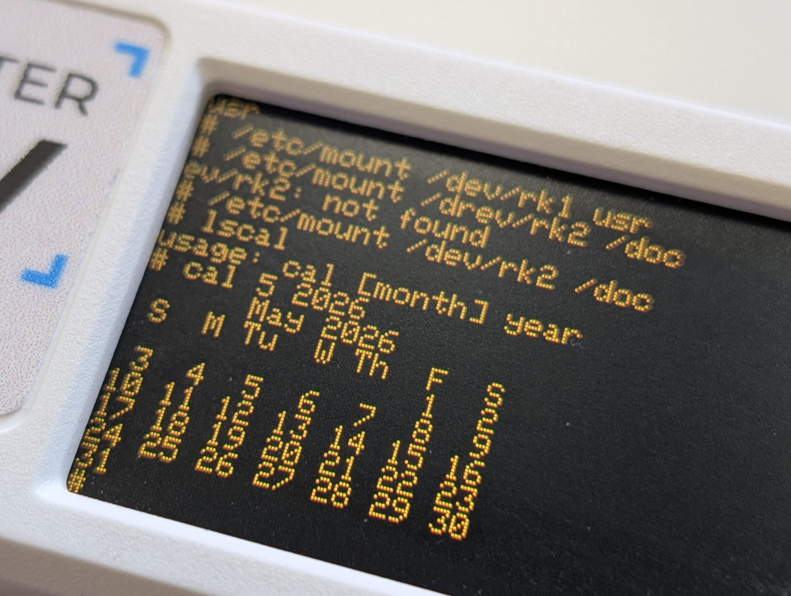
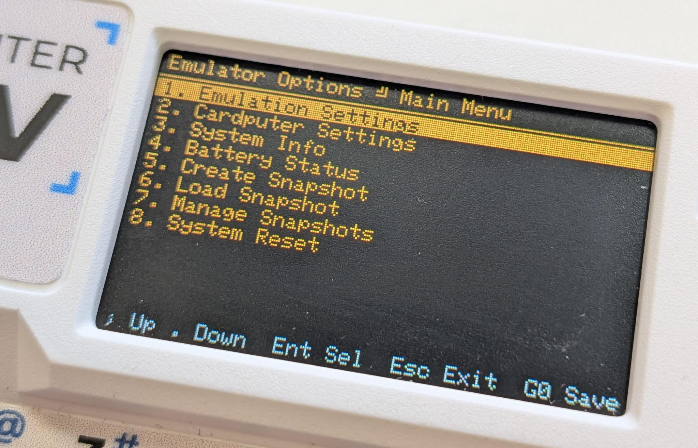

# cardPDP11 — PDP-11 Emulator for M5Stack Cardputer

A PDP-11/40 and PDP-11/23 emulator running on the **M5Stack Cardputer** (ESP32-S3).
Boot Unix V6, RT-11, RSX-11/M or RSTS/E directly from an SD card —
all from a pocket-sized device with a real keyboard.




> [!IMPORTANT]
> **Work in Progress:** This project is under active development. It may contain bugs, missing features, or performance issues.

> **Fork of** [Isysxp/PDP11-on-the-M5-Core](https://github.com/Isysxp/PDP11-on-the-M5-Core)
> by Ian Schofield. Original work ported from the M5Stack Core2 (touch screen, WiFi)
> to the Cardputer (physical keyboard, no WiFi required). See
> [`docs/UPSTREAM_README.md`](docs/UPSTREAM_README.md) for the original documentation.

---

## Table of Contents
1. [Hardware Required](#hardware-required)
2. [Emulated Hardware](#emulated-hardware)
3. [Supported Operating Systems](#supported-operating-systems)
4. [SD Card Setup](#sd-card-setup)
5. [Booting UNIX V6](#booting-unix-v6)
6. [System Snapshots](#system-snapshots)
7. [Building & Flashing](#building--flashing)
8. [Controls](#controls)
9. [Options Menu](#options-menu)
10. [Project Structure](#project-structure)
11. [Changelog](#changelog)
12. [Credits](#credits)

---

## Hardware Required

| Component | Details |
|-----------|---------|
| **M5Stack Cardputer** | ESP32-S3, 240×135 ST7789V2 display, 56-key physical keyboard |
| **MicroSD card** | FAT32 formatted; holds disk images and empty disk templates |
| **USB-C cable** | For flashing and serial debug output |

> **Hardware reset:** The physical side button on the Cardputer performs a hard
> ESP32-S3 reset at silicon level — no software needed.

---

## Emulated Hardware

| Component | Emulated Device |
|-----------|----------------|
| CPU | DEC PDP-11/40 (18-bit Unibus) **or** PDP-11/23 (22-bit Q-Bus, F-11 chip) — selectable |
| RAM | Up to 248 KB (18-bit mode, limited by internal SRAM) |
| FPU | FP11 floating-point unit |
| Instruction set | EIS (Extended Instruction Set) + MUL/DIV/ASH/ASHC |
| Disk — RK | RK11 / RK05 cartridge disk (~2.4 MB) |
| Disk — RL | RL11 / RL01 (~5 MB) and RL02 (~10 MB) disk drives |
| Console | KL11 serial (mapped to Cardputer keyboard + display) |
| Secondary serial | DL11 (available via USB serial at 115200 baud) |
| Real-time clock | KW11-L line frequency clock |

### CPU Model Differences

| Feature | PDP-11/40 | PDP-11/23 (F-11) |
|---|---|---|
| Address bus | 18-bit Unibus | 22-bit Q-Bus |
| MFPT instruction | Illegal (trap 010) | Returns `1` (F-11 ID) |
| 22-bit MMU | OS must activate | Active from reset |
| Compatible images | 18-bit OS builds | 22-bit OS builds |

> **Note:** With only 248 KB of internal SRAM (Cardputer has no PSRAM),
> both models are limited to 248 KB of RAM regardless of address bus width.
> Systems requiring >248 KB (e.g. Ultrix-11, 2.9BSD) will not run. I hope that a future version of the Cardputer will have more RAM available thus allowing you to run those OSes.

---

## Supported Operating Systems

The emulator is optimized for systems that can run within the 248 KB RAM limit of the Cardputer.

### Recommended OS Images

| Image file | OS | Boot device | Notes |
|---|---|---|---|
| `unix0_v6_rk_DL.rk05` | Unix V6 (with DL11) | RK05 | The classic Unix experience |
| `unix_v5.rk05` | Unix V5 (Fifth Edition) | RK05 | Historical vintage Unix |
| `RT11_V5_CFB.RL02` | RT-11 V5 | RL02 | Real-time OS with FORTRAN, BASIC |
| `RT11_V5_MUBasic.RL01` | RT-11 V5 + MU-BASIC | RL01 | Multi-User BASIC environment |
| `rsts_v9_iss_forth.rl02` | RSTS/E V9 + FORTH | RL02 | Time-sharing system |
| `rsx11m46-ccc.rl02` | RSX-11/M 4.6 | RL02 | Real-time Executive |

### High-Memory Images (Require >248 KB RAM)

The following images are included in the repository for reference or for future hardware with PSRAM expansion. They will **not** boot on a standard Cardputer:
- **Ultrix-11 V2/V3**
- **2.9BSD**

All images are SIMH-compatible. See [`docs/Readme.os`](docs/Readme.os) for a full list of tested images. I added those images because I hope a future version of the Cardputer will have more RAM available thus allowing you to run those OSes.

---

## SD Card Setup

To prepare your SD card, format it as **FAT32**. You must copy the contents of the `Images` directory from this repository into a folder named `pdp11` on the root of your SD card.

Your SD card structure should look like this:

```
/
└── pdp11/
    ├── Empty_RK05.dsk        ← required blank RK05 template
    ├── Empty_RL01.dsk        ← required blank RL01 template
    ├── Empty_RL02.dsk        ← required blank RL02 template
    ├── pdp11-40/             ← OS images for PDP-11/40
    │   ├── unix_v6/
    │   ├── unix_v5.rk05
    │   └── ...
    ├── pdp11-23/             ← OS images for PDP-11/23 (ref only)
    └── snapshots/            ← (Optional) Snapshots saved from the menu
```

The firmware scans `/pdp11/` **recursively** for files with `.rk05`, `.rl01`, or `.rl02` extensions.

---

## Booting UNIX V6

1. Go to **Emulation Settings** → **RK05 Drives Config** and select `unix0_v6_rk_DL.rk05` for **RK0**.
2. Exit to the terminal. If it doesn't boot automatically, perform a **System Reset**.
3. At the `@` prompt, type `rkunix` and press Enter.
4. Login as `root`.

### Mounting Extra Disks
If you have multiple disks configured (RK1, RK2...), you can mount them in Unix V6:
```bash
/etc/mount /dev/rk1 /usr
/etc/mount /dev/rk2 /doc
```
Verify with `ls /usr` or `ls /doc`.

To configure those disks, you need to add them to the `Emulation Settings` → `RK05 Drives Config` menu, selecting the proper image files.

---

## System Snapshots

You can save the entire state of the PDP-11 (CPU registers + RAM) to the SD card and resume it later instantly.

### Current Snapshots
The repository includes these pre-configured snapshots:
- **`rt-11-basic`**: RT-11 V5 with Multi-User BASIC pre-loaded and ready to use.
- **`unix5`**: Unix Fifth Edition (V5) root system.
- **`unix6-mounted-disks`**: Unix V6 with `/usr` and `/doc` already mounted, saving you the manual mount steps.

To load a snapshot, use the **Load Snapshot** option in the Main Menu.

---

## Building & Flashing

This project uses **PlatformIO**.

### Prerequisites
```bash
pip install platformio
```

### Compile & Flash
```bash
pio run -t upload
```

### Serial Monitor
```bash
pio device monitor -b 115200
```
The USB port provides debug info and a parallel PDP-11 console.

---

## Controls

### G0 Button (Orange)
The orange **G0** button opens the **Options Menu** and pauses the emulation. Pressing it again (or Esc) resumes execution.

### PDP-11 Terminal
| Key | Action |
|-----|--------|
| Any printable key | Sent to PDP-11 console |
| `Ctrl` + `letter` | ASCII control codes (`Ctrl+C`, `Ctrl+D`...) |
| `Del` | Sends DEL (0x7F) / Rubout |
| `Enter` | Sends CR (0x0D) |

---

## Options Menu



The menu is divided into several sections:

- **Emulation Settings**:
    - **CPU Model**: Toggle between PDP-11/40 and PDP-11/23.
    - **Boot Device**: Select RK05 or RL01/02 as the default boot source.
    - **RK05 Drives**: Map up to 4 virtual RK05 disks.
    - **RL01/02 Drives**: Map up to 4 virtual RL01/02 disks.
- **Cardputer Settings**:
    - **Text Colour**: Choose between Green, Amber, White, or Paper (Black on Yellowish).
    - **Brightness**: 5 levels of backlight intensity.
    - **Font Size**: Toggle between Normal (1x) and Large (2x) text.
    - **Disk Activity LED**: Enable/disable the physical LED flashes during disk I/O.
    - **Disk Seek Sounds**: Enable simulated head clacking sounds.
    - **Fan Simulation**: Enable a background "hum" for a more vintage feel.
- **Snapshots**:
    - **Create Snapshot**: Save the current machine state.
    - **Load Snapshot**: Pick a saved state to resume.
    - **Manage Snapshots**: Rename or delete existing snapshots.
- **System Info**: Displays version, free RAM, and SD card status.
- **System Reset**: Performs a soft-reboot of the emulated PDP-11.

---

## Project Structure

```
cardpPDP11/
├── src/              ← Source code
│   ├── main.cpp      ← Hardware init and main loop
│   ├── avr11.cpp     ← Instruction loop
│   ├── kb11.cpp      ← CPU implementation
│   ├── options.cpp   ← Menu system and settings
│   ├── rk11.cpp      ← RK11 Disk controller
│   ├── rl11.cpp      ← RL11 Disk controller
│   └── ...
├── Images/           ← Disk images and templates
├── docs/             ← Documentation
└── platformio.ini    ← Build config
```

---

## Changelog

### v1.0.0
- **fix: Snapshot Settings Overwriting** — Snapshots now only store/load machine states and connected disks, keeping active text colors, sound toggles, and brightness settings intact.
- **fix: Escape Key Support** — Submenus for "Disk Seek Sounds" and "Fan Simulation" can now be exited using the Escape/Back key.

### v0.1.5
- **feat: Main Menu Battery Info** — Moved battery status to the main menu.
- **fix: Snapshot Resume** — CPU now resumes automatically after loading.
- **fix: Disk LED Visibility** — Implemented a timer for human-visible LED flashes.

### v0.1.2
- **feat: Snapshot System** — Save/load machine state to SD.
- **feat: Ambient Sounds** — Disk seek "clacks" and fan hum.
- **feat: System Reset** — Reboots into boot mode.
- **feat: Multi-disk RK11** — Connect up to 4 RK05 drives.

---

## Credits

- **Ian Schofield** ([@Isysxp](https://github.com/Isysxp)) — Original M5Stack Core2 port.
- **Álvaro Ramos** ([@alvaroramosf](https://github.com/alvaroramosf)) — Cardputer port, menu system, and optimizations.
- **Dave Cheney** — [avr11](https://github.com/dchest/avr11) PDP-11 core.
- **Julius Schmidt** — JavaScript PDP-11 simulator.

---

## License
This project inherits the license terms of the upstream repository. See [`docs/UPSTREAM_README.md`](docs/UPSTREAM_README.md).
